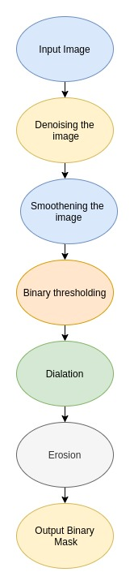
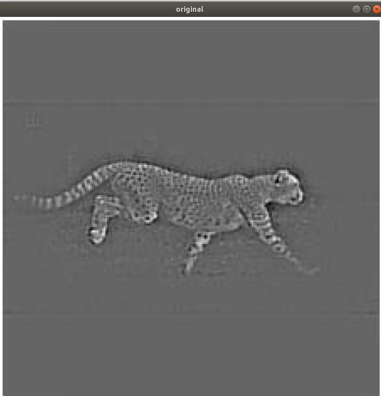
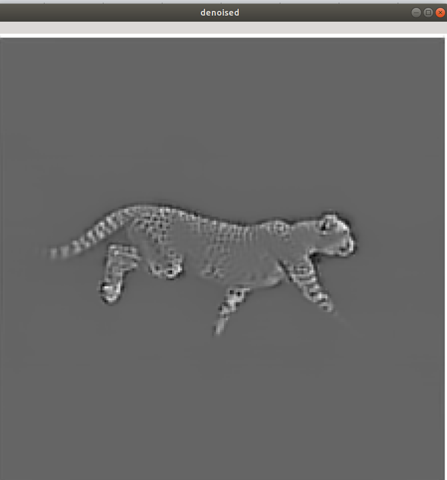
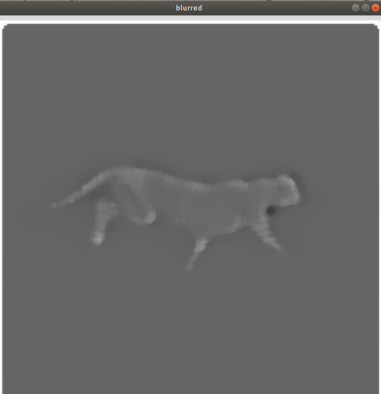

# Binarized Mask Generation using OpenCV

This code converts the target image into binarized mask. It distinguishes between foreground object and the background.

# Installations

### Install Python 3 
```
sudo apt-get install python3.6
```
### Install pip 
```
sudo apt-get install python3-pip
```
### Then install virtualenv using pip3
```
sudo pip3 install virtualenv 
```
### Now create a virtual environment
```
virtualenv venv 
```
### Active your virtual environment
```
source venv/bin/activate
```
# Setup dependencies
Install dependent python packages
```
pip install requirements.txt
```
# Run Code
### Python
```
python binarization.py -input <path to input file>
```
For example, on my system:
```
python binarization.py -input /home/ashish/Pictures/125356504.jpg
```
Type `-h` for `help`
```
python binarization.py -h
```

# Architecture
#### Following is the architecture of the system:


# Procedure
#### Original Image:


#### Denoised image: 
Non-local Means Denoising algorithm is used to remove noise in the image.(Reference: [https://opencv-python-tutroals.readthedocs.io/en/latest/py_tutorials/py_photo/py_non_local_means/py_non_local_means.html](https://opencv-python-tutroals.readthedocs.io/en/latest/py_tutorials/py_photo/py_non_local_means/py_non_local_means.html))



#### Smoothening
Median Blur with kernel size 7 is used to smoothen the image(Reference: [https://docs.opencv.org/2.4/modules/imgproc/doc/filtering.html?highlight=medianblur#medianblur](https://docs.opencv.org/2.4/modules/imgproc/doc/filtering.html?highlight=medianblur#medianblur))



#### Binary thresholding
The image is thresholded using binary thresholding
